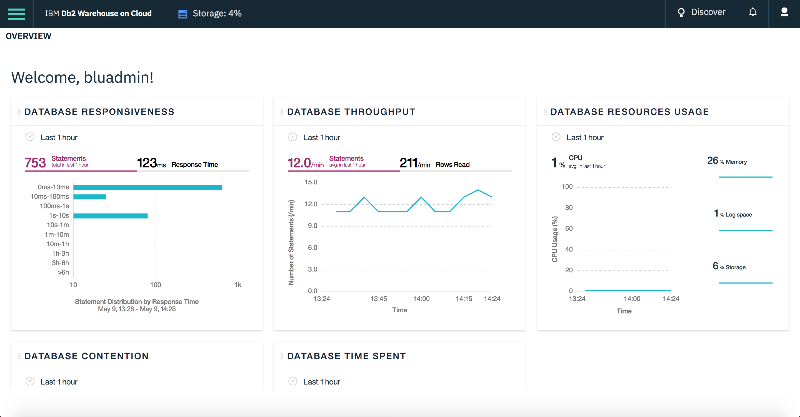

---

copyright:
  years: 2014, 2020
lastupdated: "2025-09-25"

keywords:

subcollection: db2wh-saas

---

 
{:external: target="_blank" .external}
{:shortdesc: .shortdesc}
{:codeblock: .codeblock}
{:screen: .screen}
{:tip: .tip}
{:important: .important}
{:note: .note}
{:deprecated: .deprecated}
{:pre: .pre}

# Interfaces
{: #interfaces}

You can work with your warehouse database in the following ways:
{: shortdesc}

   * From the web console
   * REST API
   * Connect applications or your favorite tools from your local computer
   * Use {{site.data.keyword.dashdbshort_notm}} as a data source for your {{site.data.keyword.Bluemix_notm}} apps or services

## Web console
{: #web_console}

The web console provides a graphical interface for everything that you need to use your database, including: load facilities, an SQL editor, driver downloads, and more.
{: shortdesc}

{: caption="Figure 1. View of the web console dashboard page" caption-side="bottom"}

You can access your web console in the following ways:
   * From your {{site.data.keyword.Bluemix_notm}} dashboard - You can open the web console from the Service Details page for your {{site.data.keyword.dashdbshort_notm}} service.
   * Direct URL - You can bookmark the URL of the web console for your {{site.data.keyword.dashdbshort_notm}} service.

## REST API
{: #int_api}

With {{site.data.keyword.dashdbshort_notm}} service plans, you can do tasks that are related to file management, loading data, and resource scaling using the database management [REST API]( https://cloud.ibm.com/docs/Db2whc?topic=Db2whc-con_rest_api)

## Connect applications or your favorite tools from your local computer
{: #connect_apps}

Configure your local environment to connect to your {{site.data.keyword.dashdbshort_notm}} database by completing the following steps:
{: shortdesc}

1. Download the [driver package](/docs/Db2whc/connecting?topic=Db2whc-dr_pkg) from the {{site.data.keyword.dashdbshort_notm}} web console.
2. Install the driver package on the computer where your apps or tools are running:
   - [Installing on Linux or PowerLinux](/docs/Db2whc/connecting?topic=Db2whc-dr_pkg#install_dr_pkg_linux)
   - [Installing on Mac OS X](/docs/Db2whc/connecting?topic=Db2whc-dr_pkg#install_dr_pkg_mac)
   - [Installing on Windows](/docs/Db2whc/connecting?topic=Db2whc-dr_pkg#install_dr_pkg_windows)
3. [Configure the driver files](/docs/Db2whc/connecting?topic=Db2whc-dr_pkg#cfg_loc_env) for your {{site.data.keyword.dashdbshort_notm}} database.
