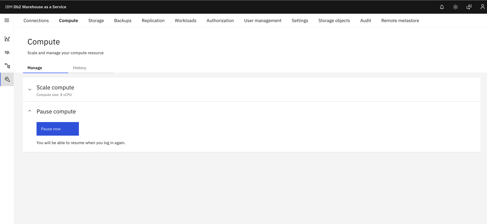
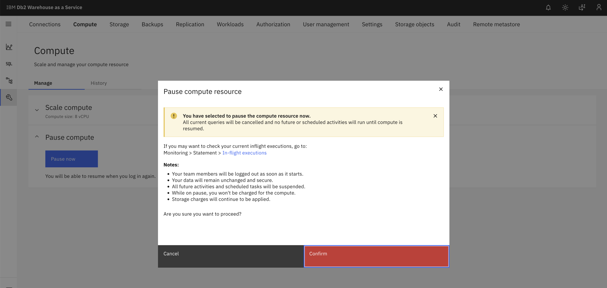
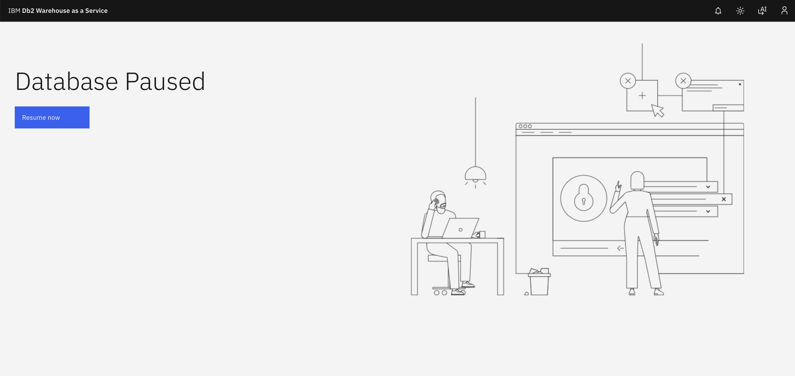
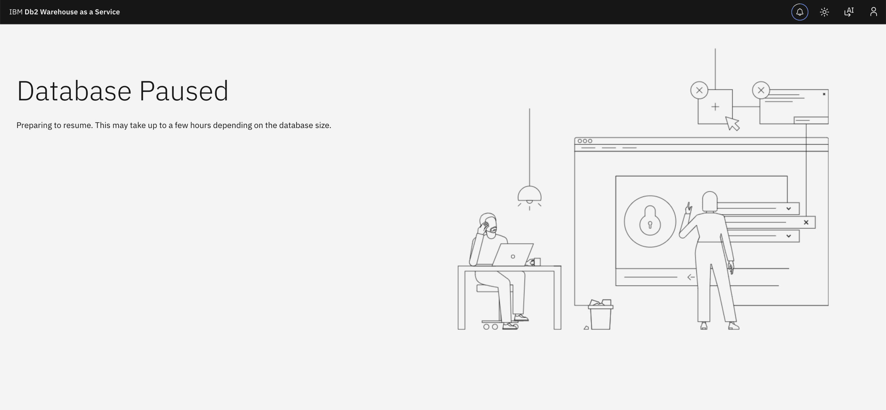
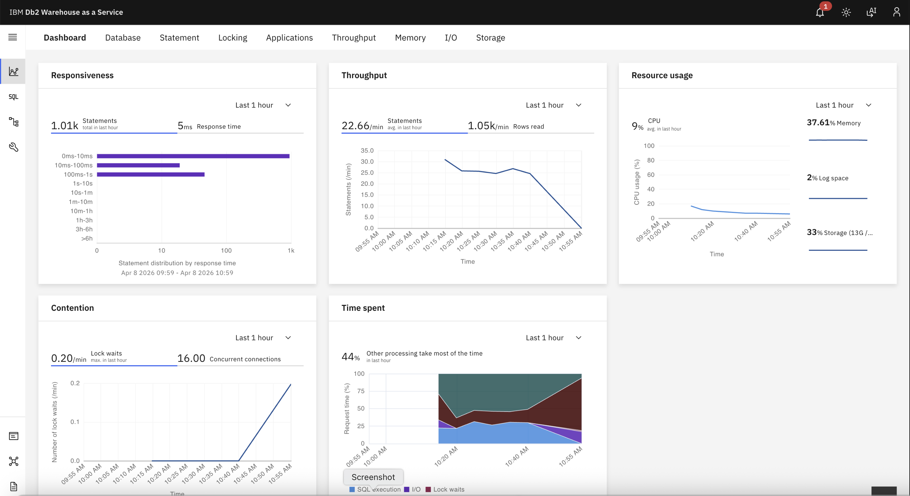

---

copyright:
  years: 2014, 2025
lastupdated: "2026-05-05"

keywords:

subcollection: db2wh-saas

---

# Pause and resume

{: #scale}

{:external: target="_blank" .external}
{:shortdesc: .shortdesc}
{:codeblock: .codeblock}
{:screen: .screen}
{:tip: .tip}
{:important: .important}
{:note: .note}
{:deprecated: .deprecated}
{:pre: .pre}

{{site.data.keyword.dashdblong}} provides you with the ability pause and resume your service.
{: shortdesc}

For information about using the REST API to pause and resume, see [REST API](https://cloud.ibm.com/apidocs/db2-warehouse-on-cloud){: external}.

- When your system is paused the system's compute is scaled down which disables data access. It will also pause compute billing for the system.

- When your system is resumed, compute billing will be resumed. Compute will scale back up. It will take a similar amount of time to a compute scaling operation for the system to become available again.

- If your system is paused during a scheduled update, it will automatically be resumed during the scheduled update time period and will billed accordingly.

Follow the steps below to pause or resume compute for your system.

## Pausing Compute

### Step 1: Navigate to Compute Settings
Login as an IAM admin user and navigate to **Administration → Compute** in the console. Click on the **Pause now** button.  

### Step 2: Confirm Pause Operation
Review the compute pause terms displayed in the pop-up window and click on the **Confirm** button to proceed with pausing the system.  

### Step 3: Verify Paused State
After clicking confirm, the system will take a few minutes to complete the pause operation. The UI will then display the **paused state**, indicating that compute resources are no longer active.  

## Resuming Compute

### Step 4: Initiate Resume Operation
When you’re ready to resume compute, log in again as an IAM admin user and click on the **Resume now** button.  

### Step 5: Wait for Resume Completion
The time required to resume will depend on your database size. Once the system is fully resumed, you can use **Db2® Warehouse as a Service** for normal business operations.  

